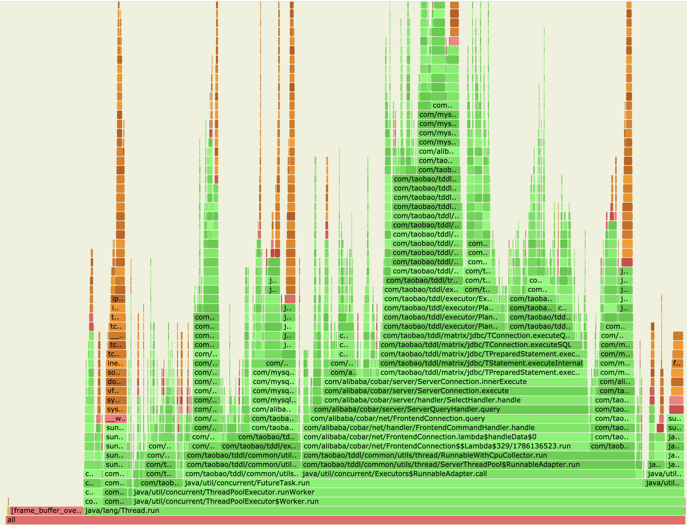

当前镜像里没有集成相应的工具，需要手动上传工具包执行（见附件）。以 CN 中的 tddl 进程为例，如下所示

```bash
# 上传 profiler tar 包到 pod 的 /tmp 目录
$ kubectl cp ~/Downloads/async-profiler.tar.gz pxc-yexi-test-cn-c6498459c-hgwn7:/tmp/ -c server

# 打开 pod 的 shell
$ kubectl exec -it pxc-yexi-test-cn-c6498459c-hgwn7 -c server -- bash

# 解压 tar 包到 /home/admin/tools 目录
$ cd /home/admin/tools && tar xzvf /tmp/async-profiler.tar.gz

# 查看 Tddl 进程
$ jps
193 TddlLauncher
467 DrdsWorker
499432 Jps

# 设置内核参数, 两种情况
#   1. 容器是 privileged，直接设置就好
#   2. 容器不是 privileged，需要去 Pod 对应的宿主机上设置
$ echo 1 >/proc/sys/kernel/perf_event_paranoid

# 查看内核参数是否正常
$ cat /proc/sys/kernel/perf_event_paranoid
1 

# 开始 profile
$ ./profiler.sh -d 80  -f /tmp/profiler-drds.svg 193

# 打开一个新的本地 shell，从 pod 里拷贝 svg 火焰图出来
$ kubectl cp pxc-yexi-test-cn-c6498459c-hgwn7:/tmp/profiler-drds.svg /tmp/profiler-drds.svg -c server

# 打开火焰图
$ open /tmp/profiler-drds.svg
```



## 附件

[async-profiler.tar.gz](./async-profiler.tar.gz)
