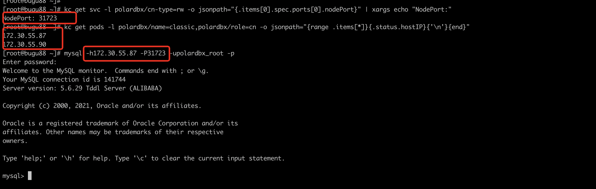

### 通过 port-forward 转发到本地访问
如果您在 K8s 集群外想访问 PolarDB-X 数据库，但是没有配置 LoadBalancer, 可以通过如下命令将服务的 3306 端口转发到本地，并且保持转发进程存活。

```shell
kubectl port-forward svc/{PolarDB-X 集群名} 3306
```

> 如果您机器的3306端口被占用，可以通过如下命令将服务转发到指定的端口上：kubectl port-forward svc/{PolarDB-X 集群名} {新端口}:3306

新开一个终端，执行如下命令即可连接 PolarDB-X：

```shell
mysql -h127.0.0.1 -P{转发端口} -upolardbx_root -p
```

> **说明: **
>    - 此处**-P**为大写字母，默认端口为3306。
>    - 为保障密码安全，**-p**后请不要填写密码，会在执行整行命令后提示您输入密码，输入后按回车即可登录。

### 通过 NodePort 访问
如果创建 PolarDB-X 集群的时候指定了 [serviceType: LoadBalancer](../../api/polardbxcluster.md) ，也可以直接通过 NodePort的方式进行访问。

通过如下命令获取所有的 nodePort:

```shell
kubectl get svc -l polardbx/name={集群名},polardbx/cn-type=rw -o jsonpath="{.items[0].spec.ports[0].nodePort}" | xargs echo "NodePort:"
```

通过如下命令获取 IP 列表：

```shell
kubectl get pods -l polardbx/name={集群名},polardbx/role=cn -o jsonpath="{range .items[*]}{.status.hostIP}{'\n'}{end}"
```

通过上述结果中的任意 IP + NodePort 即可访问 PolarDB-X：

