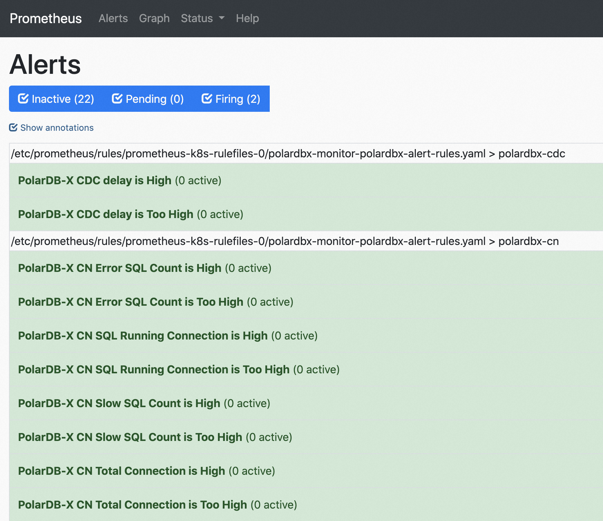

# 告警配置
polardbx-operator 基于 Prometheus + AlertManager 提供了灵活的告警能力。本文档介绍如何为 polardbx-operator 创建的集群配置报警。

## 前置条件

1. 安装 polardbx-operator 和 polardbx-monitor 组件，且 polardbx-monitor 版本不低于 1.4.0。
2. 创建一个 PolarDB-X 集群并开启监控，参考文档：[为存量集群开启监控](https://doc.polardbx.com/operator/ops/monitor/2-monitor-cluster-exist.html)。
3. 因为发送报警消息需要访问对应的渠道（邮件、钉钉），因此您的 K8s 集群需要有一台能访问对应渠道Endpoint的机器，例如需要能访问SMTP服务器或者钉钉webhook。

## 启动 AlertManager 并访问
PolarDB-X Operator 1.4.0 版本已默认集成 AlertManager 并配置开箱即用的告警能力，只需要简单几步即可开启。

1. 准备好一台具备访报警渠道Endpoint的机器，执行如下命令，为该节点打上部署 AlertManager 的标签。
```shell
kubectl label node {node 名} alertmanager=true
```
> 上述命令中的 {node ming}需要替换为 Kubectl get node 结果中的 NAME

2. 执行如下命令，开启 AlertManager并将其部署到具备 alertmanager 标签的机器上
```shell
kubectl patch alertmanager main -n polardbx-monitor --type='merge' -p '{"spec": {"replicas" : 1, "nodeSelector": {"alertmanager": "true"}}}'
```

3. 执行如下命令，等待 AlertManager 的 pod 变为 Running 状态：
```shell
kubectl get pods -n polardbx-monitor alertmanager-main-0
```

4. 执行如下命令，将 AlertManager 的端口转发到本地，并通过浏览器访问
```shell
kubectl port-forward svc/alertmanager-main --address=0.0.0.0 9093 -n polardbx-monitor
```
浏览器中输入 http://{ip}:9093/ 即可访问 AlertManager。


## 配置 AlertManager 报警推送渠道

AlertManager 支持多种报警推送渠道的配置，详见：[CONFIGURATION](https://prometheus.io/docs/alerting/latest/configuration/)。本文档以邮件和钉钉为例，介绍如何配置 AlertManager 推送报警到邮件和钉钉。

### 配置报警推送到邮件
1.创建 alertmanger-secret.yaml 文件并复制如下内容到文件中：
```yaml
apiVersion: v1
kind: Secret
metadata:
  name: alertmanager-main
  namespace: polardbx-monitor
  labels:
    app.kubernetes.io/instance: polardbx-monitor
    app.kubernetes.io/managed-by: Helm
stringData:
  alertmanager.yaml: |-
    global:
      smtp_smarthost: smtp.gmail.com:587         ## 发送报警的邮箱配置
      smtp_from: <smtp mail from>
      smtp_auth_username: <usernae>
      smtp_auth_identity: <username>
      smtp_auth_password: <password>
    receivers:
    - name: email_receiver
      email_configs:
      - to: <mail to address>    ## 推送报警的邮箱列表
        send_resolved: true
    route:
      group_by:
      - job
      group_interval: 5m
      group_wait: 30s
      receiver: email_receiver
      repeat_interval: 12h
      routes:
      - receiver: email_receiver
        group_wait: 10s
    templates:
    - '/etc/alertmanager/config/*.tmpl'
type: Opaque
```
2. 修改上述文件中 global及receivers.email_configs.to 相关配置项，填写发送报警邮件的邮箱信息。
3. 执行如下命令应用上述配置：
```shell
kubectl delete -f alertmanger-secret.yaml
kubectl apply -f alertmanger-secret.yaml
```

### 配置报警推送到钉钉

AlertManager 目前还没有直接支持钉钉，如果需要发送消息到钉钉，需要部署钉钉报警的插件，通过webhook的方式，将AlertManager的消息转换成钉钉的报警格式，发送出去。

1. 在钉钉群中创建一个 webhook 机器人，并记录下 webhook 的 url 和 secret。
2. 创建 dingtalk-webhook.yaml, 并复制如下内容到dingtalk-webhook.yaml中：
```yaml
apiVersion: v1
data:
  config.yaml: |
    ##
    # This config is for prometheus-webhook-dingtalk instead of Kubernetes!
    ##

    ## Request timeout
    # timeout: 5s

    ## Customizable templates path
    templates:
      - /config/template.tmpl

    ## You can also override default template using `default_message`
    ## The following example to use the 'legacy' template from v0.3.0
    # default_message:
    #   title: '{{ template "legacy.title" . }}'
    #   text: '{{ template "legacy.content" . }}'
    targets:
      webhook1:
        # 修改这边的url 和 secret即可
        url: https://oapi.dingtalk.com/robot/send?access_token=e2***
        secret: SECc*****
kind: ConfigMap
metadata:
  labels:
    app: alertmanager-webhook-dingtalk
  name: alertmanager-webhook-dingtalk-config
  namespace: polardbx-monitor
---
apiVersion: apps/v1
kind: Deployment
metadata:
  labels:
    run: dingtalk
  name: webhook-dingtalk
  namespace: polardbx-monitor
spec:
  replicas: 1
  selector:
    matchLabels:
      alertmanager: true
  template:
    metadata:
      labels:
        run: dingtalk
    spec:
      containers:
      - args:
        - --web.listen-address=:8060
        - --config.file=/config/config.yaml
        image: timonwong/prometheus-webhook-dingtalk:v1.4.0
        name: alertmanager-webhook-dingtalk
        ports:
        - containerPort: 8060
          name: http
        resources:
          limits:
            cpu: 100m
            memory: 100Mi
        volumeMounts:
        - mountPath: /config
          name: config
      volumes:
      - configMap:
          name: alertmanager-webhook-dingtalk-config
        name: config
---
apiVersion: v1
kind: Service
metadata:
  labels:
    run: dingtalk
  name: webhook-dingtalk
  namespace: polardbx-monitor
spec:
  ports:
  - port: 8060
    protocol: TCP
    targetPort: 8060
  selector:
    run: dingtalk
  sessionAffinity: None
```
> 注意：24行的 url 和 secret字段为你配置的钉钉机器人配置。

2. 执行如下命令，部署钉钉报警插件：
```shell
kubectl apply -f dingtalk-webhook.yaml
```

3.执行如下命令创建 alertmanger-secret.yaml
```shell
vim alertmanger-secret.yaml
```
拷贝如下内容到 alertmanger-secret.yaml中：
```yaml
apiVersion: v1
kind: Secret
metadata:
  name: alertmanager-main
  namespace: polardbx-monitor
  labels:
    app.kubernetes.io/instance: polardbx-monitor
    app.kubernetes.io/managed-by: Helm
stringData:
  alertmanager.yaml: |-
    global:
      resolve_timeout: 5m
    receivers:
    - name: dingtalk-webhook
      webhook_configs:
      - send_resolved: true
        url: "http://webhook-dingtalk.polardbx-monitor:8060/dingtalk/webhook1/send"
    route:
      group_by:
      - job
      group_interval: 5m
      group_wait: 30s
      receiver: dingtalk-webhook
      repeat_interval: 12h
      routes:
      - receiver: dingtalk-webhook
        group_wait: 10s
    templates:
    - '/etc/alertmanager/config/*.tmpl'
type: Opaque
```

4. 执行如下命令应用报警配置：
```shell
kubectl delete -f alertmanger-secret.yaml
kubectl apply -f alertmanger-secret.yaml
```

## 查看已有告警项

方法 1：参考文档：[查看监控](https://doc.polardbx.com/operator/ops/monitor/3-monitoring.html) 访问Prometheus 控制台，查看 Alerts Tab 页面，即可查看到系统重已配置的告警项。如下图所示：



方法2：

PolarDB-X 的告警项都是通过 PrometheusRule 对象配置的，执行如下命令，看下 PolarDB-X 的 PrometheusRule：
```shell
kubectl get prometheusrule -n polardbx-monitor polardbx-alert-rules -o yaml
```

您也可以通过如下的命令修改 PrometheusRule 中的告警配置或者增加新的告警项：
```shell
kubectl edit prometheusrule -n polardbx-monitor polardbx-alert-rules
```