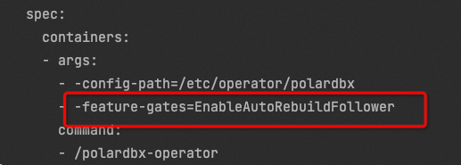

自动备库重搭
===========================
PolarDB-X Operator 从 1.4.0 版本开始支持自动备库重搭，会检测数据节点备库的状态，在一定条件下自动发起备库重搭任务。

## 开关
默认关闭。 如需打开，可设置operator启动参数 `-feature-gates=EnableAutoRebuildFollower`， 多个feature-gate之间使用`,`分隔。

### 方式1：helm安装或者升级operator时指定
编辑values.yaml文件中`featureGates`字段,如下所示：
```yaml
controllerManager:
  name: polardbx-controller-manager
  featureGates: [ EnableAutoRebuildFollower ]
```

### 方式2：直接修改operator的deployment定义
修改.spec.containers[0].args 如下
```bash
kubectl -n polardbx-operator-system edit deployment  polardbx-controller-manager
```


## 触发条件
备库上执行`show slave status`的返回结果需要满足以下条件:

- `Slave_SQL_Running`为`No`
- `Last_SQL_Error`不为空


