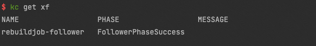

重搭follower节点
================

## 检查follower节点是否为无法恢复


## 对follower节点发起跨机备库重搭
```yaml
apiVersion: polardbx.aliyun.com/v1
kind: XStoreFollower
metadata:
  name: rebuildjob-follower
spec:
  local: false
  targetPodName: rebuild-demo-6jrr-dn-0-cand-1
  xStoreName: rebuild-demo-6jrr-dn-0
```

## 对follower发起本机备库重搭
```yaml
apiVersion: polardbx.aliyun.com/v1
kind: XStoreFollower
metadata:
  name: rebuildjob-follower
spec:
  local: true
  targetPodName: rebuild-demo-6jrr-dn-0-cand-1
  xStoreName: rebuild-demo-6jrr-dn-0
```

## 查看备库重搭任务是否成功


## 删除备库重搭任务
```bash
kubectl delete xf rebuildjob-follower
```