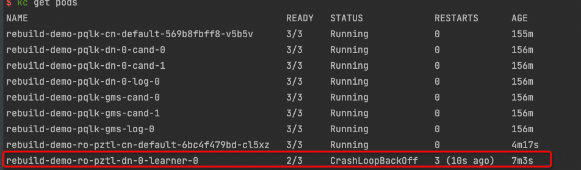
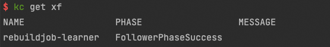

重搭learner节点（只读实例下的DN节点）
================

## 检查follower节点是否为无法恢复


## 对learner节点发起跨机备库重搭
```yaml
apiVersion: polardbx.aliyun.com/v1
kind: XStoreFollower
metadata:
  name: rebuildjob-learner
spec:
  local: false
  targetPodName: rebuild-demo-ro-pztl-dn-0-learner-0
  xStoreName: rebuild-demo-pqlk-dn-0
```

## 对learner发起本机备库重搭
```yaml
apiVersion: polardbx.aliyun.com/v1
kind: XStoreFollower
metadata:
  name: rebuildjob-learner
spec:
  local: true
  targetPodName: rebuild-demo-ro-pztl-dn-0-learner-0
  xStoreName: rebuild-demo-pqlk-dn-0
```
>> 注意： xStoreName需要填，只读节点对应的主节点的xstore实例名称
## 查看备库重搭任务是否成功


## 删除备库重搭任务
```bash
kubectl delete xf rebuildjob-learner
```