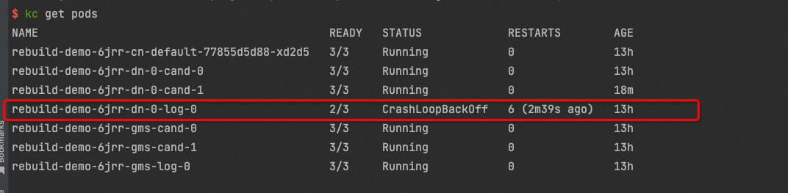
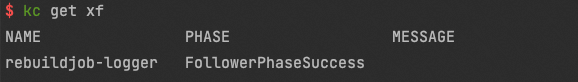

重搭logger节点
================

## 检查logger节点是否为无法恢复
!

## 对logger节点发起跨机备库重搭
```yaml
apiVersion: polardbx.aliyun.com/v1
kind: XStoreFollower
metadata:
  name: rebuildjob-logger
spec:
  local: false
  targetPodName: rebuild-demo-6jrr-dn-0-log-0
  xStoreName: rebuild-demo-6jrr-dn-0
```

## 对follower发起本机备库重搭
```yaml
apiVersion: polardbx.aliyun.com/v1
kind: XStoreFollower
metadata:
  name: rebuildjob-logger
spec:
  local: true
  targetPodName: rebuild-demo-6jrr-dn-0-log-0
  xStoreName: rebuild-demo-6jrr-dn-0
```

## 查看备库重搭任务是否成功


## 删除备库重搭任务
```bash
kubectl delete xf rebuildjob-logger
```